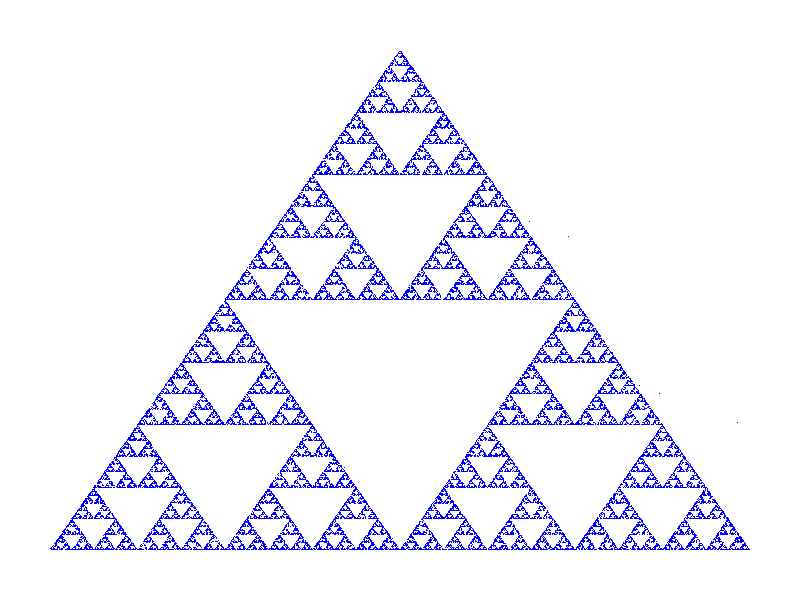

# 3D Interactive Sierpinski Tetrahedron

This project is a Python application that generates and displays a 3D visualization of a Sierpinski Tetrahedron. It uses `pygame` for windowing and real-time user input, and `PyOpenGL` for 3D rendering.



## How It Works

The visualization is generated using a random algorithm known as the "chaos game":
1.  Start with the four vertices of a tetrahedron.
2.  Pick a random point in 3D space.
3.  Repeatedly move that point halfway towards one of the randomly chosen vertices.
4.  After many iterations, the collection of points forms the fractal shape of a Sierpinski Tetrahedron.

The application renders these thousands of points in a 3D space that you can interact with.

## Setup and Installation

To run this visualization, you'll need Python 3.

1.  **Clone the repository:**
    ```bash
    git clone https://github.com/bharat/sierpinski.git
    cd sierpinski
    ```

2.  **Create and activate a virtual environment:**
    ```bash
    python3 -m venv venv
    source venv/bin/activate
    ```
    *(On Windows, use `venv\Scripts\activate`)*

3.  **Install the required packages:**
    ```bash
    pip install -r requirements.txt
    ```

## Running the Application

Once the setup is complete, you can run the application with the following command:

```bash
python3 sierpinski.py
```

## Controls

- **Rotate**: Click and drag the left mouse button to rotate the tetrahedron.
- **Zoom**: Use the mouse scroll wheel to zoom in and out.
- **Quit**: Close the window or press the `ESC` key. 